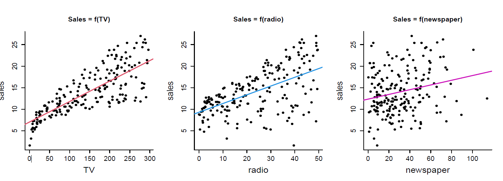
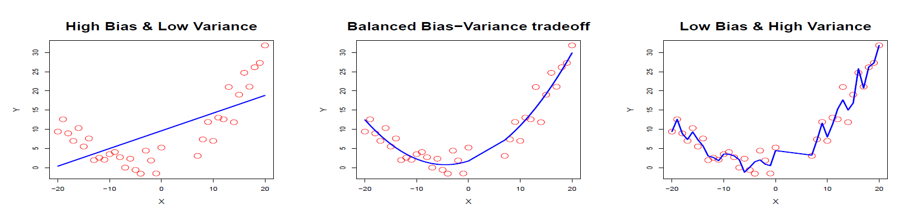
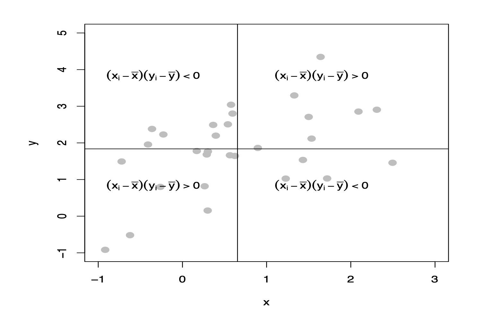

# Statistical learning

L'obiettivo è quell odi predire una risposta basandosi su una serie di variabili esplicative. Questo è un problema di **regressione** se la risposta è continua, oppure di **classificazione** se la risposta è categorica.

Si divide in due:

- **Supervised learning**: si hanno delle osservazioni $(x_1, y_1), \dots, (x_n, y_n)$ e si vuole individuare il valore di $y$ essendo a conoscenza di $x$. Questo è un problema di **regressione** (o **predizione**) se la risposta è continua, oppure di **classificazione** se la risposta è discreta.

- **Unsupervised learning**: si hanno delle osservazioni $(x_1, \dots, x_n)$ e si vuole capire la struttura di $x$.

## Notazione
Per spiegare la notazione faremo uso di un esempio. Supponiamo di voler capire come variano le vendite di una campagna pubblicitaria in base al luogo dove viene trasmessa (*TV*, *radio*, *newspaper*).

- $Y$: variabile **risposta** / **obiettivo** / **risultato** / **output** (in questo caso le vendite)
- $X_1, \dots, X_n$: variabili **caratteristiche** / **predittori** / **regressori**  (in questo caso *TV*, *radio*, *newspaper*)
- $X$ è il vettore che contiene le variabili caratteristiche (in questo caso $X = (X_1, X_2, X_3)$)
- Il nostro **modello** sarà quindi la funzione: ($\epsilon$ indica l'errore o discrepanze tra il modello e i dati reali)
$$
Y = m(X) + \epsilon
$$

In pratica, il nostro obiettivo è quello di trovare la funzione $m$ (che in futuro indicheremo con $\hat{m}(X)$)che meglio approssima i dati reali.

I motivi per cui stimeremo $m$ sono:
- predizioni
- inferenza (interpretazione dei dati)

### Predizioni vs inferenza
- **Predizioni**: capire le possibiltà che un determinato evento succeda o meno
- **Inferenza**: determinare il motivo per cui un determinato evento succederà o meno

## Generalità
Quando costruiamo un modello $\hat{m}$ vogliamo che sia **flessibile** (ovvero che si adatti bene ai dati) ma che allo stesso tempo sia **semplice** (ovvero che sia facile da interpretare).
Un modello deve essere il più **bilanciato** possibile, non deve **sottostimare** ne **sovrastimare** i dati.

## Compromesso tra bias e varianza (bias-variance tradeoff)
Il **bias** è l'errore che si commette quando si approssima un problema complesso con un modello semplice. Un modello con un alto bias tenderà a sottostimare i dati. La **varianza** è l'errore che si commette quando si approssima un problema semplice con un modello complesso. Un modello con una alta varianza tenderà a sovrastimare i dati.

## Compromesso tra interpretabilità e flessibiltià (interpretability-flexibility tradeoff)
Possiamo costrutire sia modelli che sono molto flessibili ma poco interpretabili, sia modelli che sono poco flessibili ma molto interpretabili. Un modello flessibile è un modello che si adatta bene ai dati, mentre un modello interpretabile è un modello che è facile da interpretare.

Preferiremo modelli più strutturati rispetto a modelli più flessibili.

# Probabilità base
Di seguito una sere di definizioni sulla probabilità di base

- **Valore atteso** : Il valore atteso di una variabile casuale $X$ è la media dei valori che $X$ può assumere, pesati per la probabilità che essi si verifichino.

- **Varianza**: La varianza di una variabile casuale $X$ è una misura della sua dispersione. È definita come la media dei quadrati delle differenze tra il valore atteso di $X$ e i valori che $X$ può assumere, pesati per la probabilità che essi si verifichino.

- **Covarianza**: La covarianza è una misura della relazione lineare tra due variabili casuali. È definita come la media dei prodotti delle differenze tra il valore atteso di $X$ e i valori che $X$ può assumere, pesati per la probabilità che essi si verifichino.

# Il predittore lineare ottimale

$$
\beta_0 = E[Y] - \beta_1 E[X]
$$
- $\beta_0$, l'intercetta ottimale, obbliga la retta a passare per il la media di $Y$ quando $X = 0$
- $\beta_1 = \frac{Cov(X, Y)}{Var(X)}$
- L'**inclinazione** aumenta all'aumentare di $Cov(X,Y)$ e diminuisce all'aumentare di $Var(X)$
- I valori attesi $$ e $$ non hanno alcun ruolo all'interno della formula, l'unica cosa che conta sono $Cov(X,Y)$ e $Var(X)$, le quali non cambiano se si aggiungono / sottraggono costanti

Concludiamo quindi che $\beta_0 + \beta_1 x$ rappresentano la **retta di regressione ottimale** ( o *predittore lineare ottimale*)

# Covaianza e correlazione empiriche
Con il termine **empirico** intendiamo che stiamo lavorando con un campione di dati **reali**, **NON** con dati **teorici**.

## Covarianza
$$
c_{XY} = \frac{1}{n}(\sum_{i=1}^nx_iy_i - n\bar{x}\bar{y})
$$
- $c_{XY}$ è la covarianza empirica tra $X$ e $Y$
- $n$ è il numero di osservazioni
- $\bar{x}$ è la media (campionaria) di $X$
- $\bar{y}$ è la media (campionaria) di $Y$

## Correlazione (indice di Pearson)
$$
r_{XY} = \frac{c_{XY}}{s_xs_y}
$$
- $r_{XY}$ è la correlazione empirica tra $X$ e $Y$
- $s_x$ è la deviazione standard (campionaria) di $X$
- $s_y$ è la deviazione standard (campionaria) di $Y$
- $r_{XY}$ restituisce un valore compreso tra $-1$ e $1$

In base al valore dell'indice di Person possiamo capire dove si trova la concentrazione.

# Modello di regressione lineare semplice
E' un modello statistico a due variabili $X$ e $Y$ che ha l'obiettivo di predirree/spiegare $Y$ essendo a conoscenza di $X$.

## Stima plug-in
Il predittore ottimale di $Y$ dato $X$ ha pendenza e intercetta pari a:

$$
\beta_1 = \frac{Cov(X,Y)}{Var(X)}, \quad \beta_0=E[Y] - \beta_0E[X]
$$

Non essendo a conoscenza dell'intera popolazione ma di soltanto una parte, si useranno quindi i valori campionari:

$$
\hat{\beta_1} = \frac{c_{XY}}{s_x^2}, \quad \hat{\beta_0}= \bar{y} - \hat{\beta_1}\bar{x}
$$
## Stima metodo minimi quadrati
Lo stesso risultato lo ottengo anche se utilizzo il metodo dei **minimi quadrati**.
